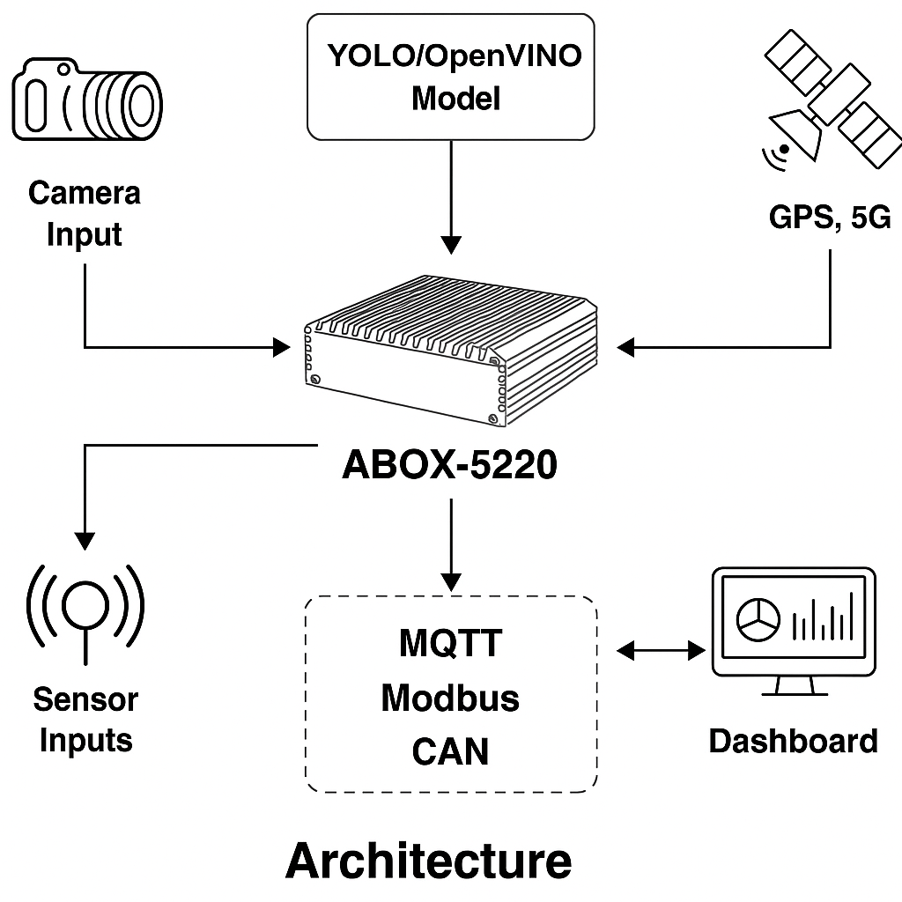

# Project Documentation

This section will include architecture diagrams, wiring guides, and hardware setup.

# Sintrones Edge AI Starter Kit

Welcome to the Edge AI Vision + Sensor Gateway project by Sintrones.

## 🚀 Features
- Real-time sensor monitoring (Modbus/MQTT)
- AI edge inference (OpenVINO/YOLO-ready)
- OTA updates, ruggedized deployment
- Example use cases: Factory, Vehicle, Smart City

## 📚 Use Cases
- [Factory Automation](../examples/factory_automation/README.md)
- Vehicle Diagnostics
- Smart City Monitoring

## 📦 Architecture


## 🧪 Quick Start
```bash
pip install -r requirements.txt
python src/main.py
